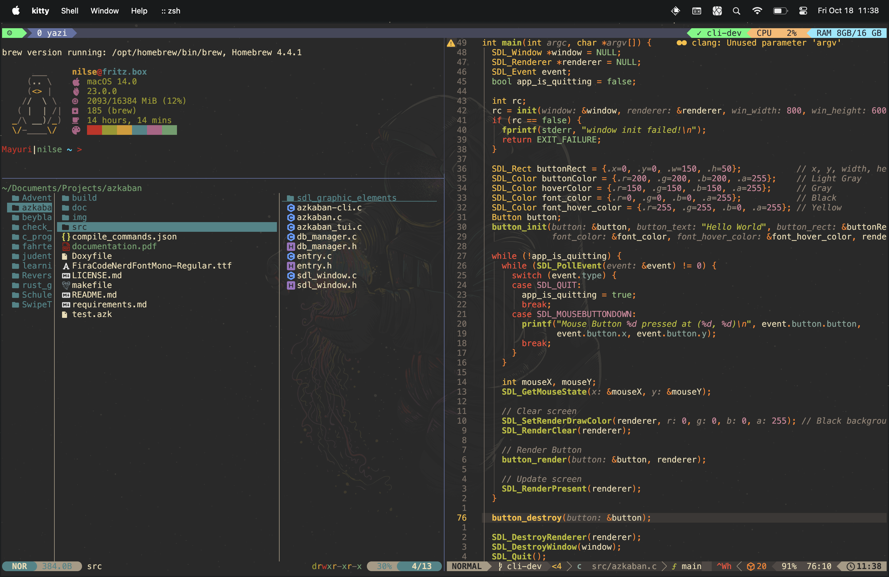

# .dotfiles



A collection of my personal dotfiles for configuring various development tools and environments. This repository contains configurations for terminal emulators, window managers, text editors, and more.

## What's Inside

- **Terminal Emulators**
  - Alacritty
  - Kitty (with Gruvbox theme)

- **Window Manager**
  - i3 (with compton and i3blocks)

- **Text Editors**
  - Neovim (extensive configuration with plugins)
  - Vim (with Gruvbox colorscheme)

- **File Manager**
  - Yazi

- **LaTeX Templates**
  - Standard project template

- **Scripts**
  - Repository switching utility
  - Tmux session management
  - OS-specific setup scripts

## Directory Structure

```
.
├── alacritty            # Alacritty terminal configuration
├── i3                   # i3 window manager configuration
├── kitty                # Kitty terminal configuration
├── Latex_template       # LaTeX project templates
├── nvim                 # Neovim configuration
│   ├── after            # Filetype-specific settings
│   ├── lua              # Lua configuration files
│   │   ├── config       # Core configuration
│   │   └── plugins      # Plugin-specific settings
│   └── snippets         # Custom code snippets
├── scripts              # Utility scripts
│   └── tmux_repo_config # Tmux session configurations
├── setup-scripts        # OS-specific setup scripts
├── vim                  # Vim configuration
├── vimrc                # Vim configuration file
├── wallpaper            # Wallpaper images
└── yazi                 # Yazi file manager configuration
```

## Installation

### Clone the Repository

```bash
git clone https://github.com/NilsEckerle/.dotfiles.git ~/.dotfiles
```

### Start the Setup

Choose the appropriate setup script based on your operating system:

```bash
cd ~/.dotfiles
./setup-scripts/linux.sh   # For Linux
# OR
./setup-scripts/macos.sh   # For macOS
```

## Features

- Consistent theming across applications (Gruvbox-inspired)
- Optimized Neovim configuration with LSP support
- Custom i3 window manager setup
- Terminal multiplexer (tmux) configurations
- LaTeX workflow templates
- Quality-of-life utility scripts

## Dependencies

The configurations in this repository may require the following software to be installed:

- Neovim (>= 0.9.0)
- i3 window manager
- Alacritty or Kitty terminal
- tmux
- LaTeX (for LaTeX templates)
- Yazi file manager

## Customization

Feel free to fork this repository and modify the configurations to suit your preferences. The modular structure makes it easy to include or exclude specific components.

## Contributing

Suggestions and improvements are welcome! If you have ideas to enhance these configurations:

1. Fork the repository
2. Create a feature branch
3. Submit a pull request

## License

This project is licensed under the MIT License - see the [LICENSE](LICENSE) file for details.
